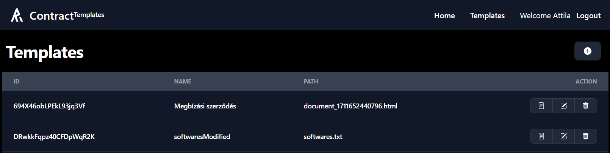

# Contract Templates

[](https://github.com/Reterics/contract-templates/actions/workflows/npm-publish-github-packages.yml)

This is a [Next.js](https://nextjs.org/) project with [TailwindCSS](https://tailwindcss.com/) and [Firebase](https://firebase.google.com/) where we can create, manage our dynamic contracts and documents.

By allowing users to craft a single template that can be populated with different data, this application can significantly reduce the time and effort required for initial administrative tasks. This efficiency not only accelerates the contract generation process but also ensures consistency and accuracy across all documents. Such tools are invaluable in today's fast-paced business environment where agility and time-saving strategies are key to staying competitive.


## Getting started

### Requirements
For the latest stable version you will need to have a 
 - [x] [Firebase Application](https://console.firebase.google.com/project/) and
 - [ ] [TinyMCE](https://www.tiny.cloud/) API Key (Optional)

ready.

### Install
First step is to create a .env file using .env.template as a reference and fill all of the information based on your Firebase project.

```
#firebase configurations in .env file
VITE_FIREBASE_APIKEY=your_api_key
VITE_FIREBASE_AUTH_DOMAIN=your-auth-domain
VITE_FIREBASE_PROJECT_ID=your-project_id
VITE_FIREBASE_STORAGE_BUCKET=your_storage_bucket
VITE_FIREBASE_MESSAGE_SENDER_ID=your-message-sender-id
VITE_FIREBASE_APP_ID=your-firebase-id
VITE_FIREBASE_MEASUREMENT_ID=your-measurement-id

VITE_FIREBASE_DB_TEMPLATES=your-templates-collection-name
VITE_FIREBASE_DB_DOCUMENTS=your-documents-collection-name
VITE_TINYMCE=
```

```bash
npm install
npm run build
npm run start
```

### First Run

If you are using a local environment then your application will be ready on [http://localhost:5173/](http://localhost:5173/).

After you logged in with your Firebase user, you will see your created **Document** list. (initially empty)

You can create and manage your **Templates** in the Templates menu.


In the top right corner, you can create your own template.

In the Popup Modal you can either upload your document as a **HTML** format or create one with the **TinyMCE Editor**.


In order to put always changing variables you will need to put your texts inside "**curly brackets**" or commonly known as "**Handlebars**"

If you use **{{first_name}}**, then in the future you can put anyone's first name in that place replacing the current text.

You can try this method out by clicking the first action button.


In the following screen we can fill out our new document using the template we just created.


We can save, export and print our document.


## Contribute

There are many ways to [contribute](https://github.com/Reterics/contract-templates/blob/main/CONTRIBUTING.md) to Contract Templates.
* [Submit bugs](https://github.com/Reterics/contract-templates/issues) and help us verify fixes as they are checked in.
* Review the [source code changes](https://github.com/Reterics/contract-templates/pulls).
* [Contribute bug fixes](https://github.com/Reterics/contract-templates/blob/main/CONTRIBUTING.md).

